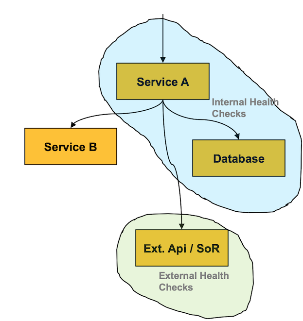

# SDA Commons Server Health Check

[](https://javadoc.io/doc/org.sdase.commons/sda-commons-server-healthcheck)

In a Microservice architecture pattern sometimes a service instance can be incapable of handling
requests but is still running. For example, it might have ran out of database connections.
When this occurs, the monitoring system should generate an alert.

## Health States

In the SDA Platform, following three health states are distinguished:

* **Liveness:** is a service instance running
* **Readiness:** is a service instance running and ready to process requests
* **Fitness:** is a service instance running and ready and all dependent components outside of the platform are  
  functional.
If a service is not ready, it is also not fit.

### Liveness

A liveness check monitors if the service instance is *(still)* responding. To verify this, 
Dropwizard provides a ping endpoint at the admin port:

```
http://{serviceURL}:{adminPort}/ping
```

In case the check fails the service instance should be restarted. This can be achieved using a 
Kubernetes liveness probe that can be added to a pod: 

```
livenessProbe:
  httpGet:
    path: /ping
    port: 8081
  initialDelaySeconds: 10
  periodSeconds: 30
```

### Readiness

A readiness check monitors if the service instance is running and is currently ready to process
requests. Health checks should therefor monitor all components that are required to fulfil its 
purpose and are under governance of the service. This includes databases that are owned by the
service, but doesn't include other services that are consumed by the service. The SDA Platform 
classifies these health checks as _internal_.

Consumed services inside the SDA Platform are responsible for their monitoring themselves. Including 
another service of the platform in the own health checks would hide the cause of errors in the 
monitoring and increases the time for fixing.

To verify this, Dropwizard provides health checks, however has no distinction between _internal_ and 
_external_ health checks. Therefor the [`InternalHealthCheckEndpointBundle`](./src/main/java/org/sdase/commons/server/healthcheck/InternalHealthCheckEndpointBundle.java) 
publishes a new endpoint at the admin port:
 
```
http://{serviceURL}:{adminPort}/healthcheck/internal
```

This endpoint only considers _internal_ health checks. The response status is _500_ if at least one 
_internal_ health check reports unhealthy. All health checks that are not explicitly marked as 
_external_ are _internal_ health checks.



If the check fails the service instance should not receive new incoming requests. This can be 
achieved using a Kubernetes readiness probe that can be added to a pod:

```
readinessProbe:
  httpGet:
    path: /healthcheck/internal
    port: 8081
  initialDelaySeconds: 10
  periodSeconds: 30
```

### Fitness

A fitness check monitors if the service instance is running and ready and are all dependent components 
outside of the platform are functional. If a service is not ready, it is also not fit. For example a service 
might require an external service that is not part of our SLA. In that case the fitness check allows to 
monitor such down times. The SDA platform classifies such health checks as _external_.

Dropwizard does not support _external_ health checks by default, but the marker annotation 
[`ExternalHealthCheck`](./src/main/java/org/sdase/commons/server/healthcheck/ExternalHealthCheck.java) 
makes it possible to mark an health check as _external_. This causes the health check to be excluded
from the _internal_ health check endpoint at:
 
```
http://{serviceURL}:{adminPort}/healthcheck/internal
``` 

However the result of the health check is still available at the default health check endpoint:
 
```
http://{serviceURL}:{adminPort}/healthcheck
```

The [`ExternalServiceHealthCheck`](./src/main/java/org/sdase/commons/server/healthcheck/helper/ExternalServiceHealthCheck.java) 
is a configurable implementation to check if a dependent external REST API is healthy by sending a **GET** 
request and validating the response status.   

If a fitness check fails, an automatic action can not be taken. Instead an admin could be notified 
to communicate with the external partner. In combination with the [`sda-commons-server-prometheus`](../sda-commons-server-prometheus/README.md) 
package the results of the health checks are exported to prometheus for long term monitoring.
