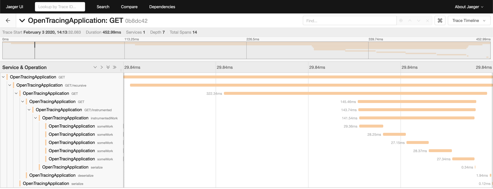

# SDA Commons Server Open Tracing Example

This module is an example for a service instrumented using [OpenTracing](https://opentracing.io/).

The usage of the modules [sda-commons-server-opentracing](../sda-commons-server-opentracing/README.md) and [sda-commons-server-jaeger](../sda-commons-server-jaeger/README.md) are presented. 
See the [`OpenTracingApplication`](./src/main/java/org/sdase/commons/server/opentracing/example/OpenTracingApplication.java) for the examples.

## How to run the example

Start the example app an pass `server config.yml` as command line arguments.
You also have to start Jaeger from [local-infra](https://github.com/SDA-SE/local-infra).
Afterwards you can perform the following requests:

- [http://localhost:8080/](http://localhost:8080/)
- [http://localhost:8080/recursive](http://localhost:8080/recursive)
- [http://localhost:8080/error](http://localhost:8080/error)
- [http://localhost:8080/search](http://localhost:8080/search)
- [http://localhost:8080/instrumented](http://localhost:8080/instrumented)
- [http://localhost:8080/param/value](http://localhost:8080/param/value)

You can observe the traces in the [Jaeger Query UI](http://localhost:16686/):

